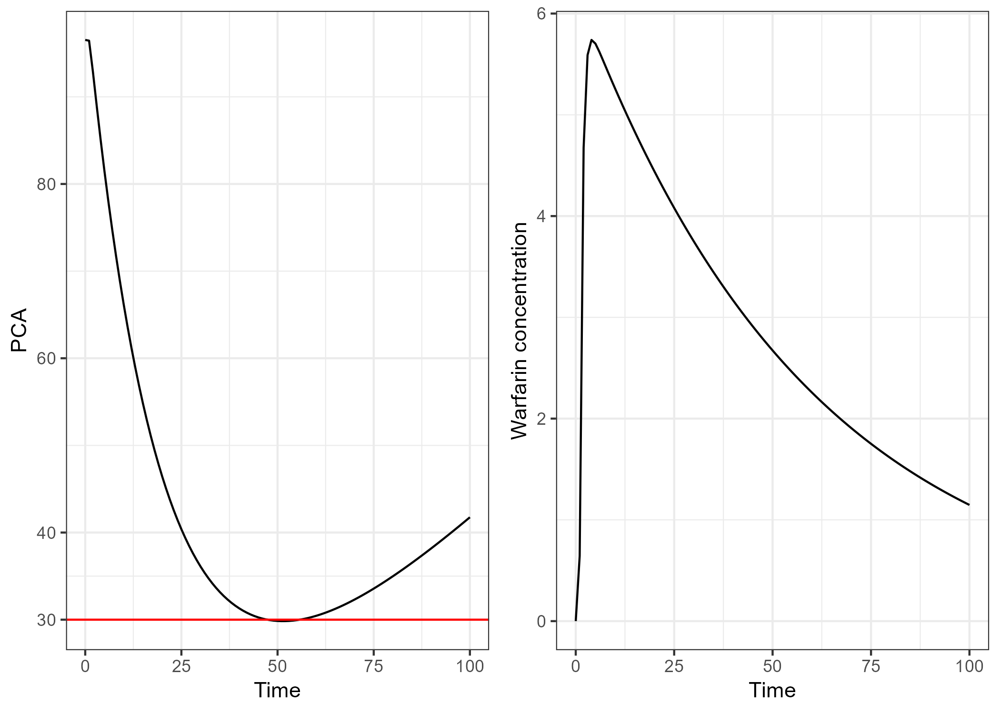

```{r setup, include=FALSE}
knitr::opts_chunk$set(out.width = "100%")

for(i in dir("./R")){
  source(paste0("./R/",i))
}
```

# optiDoseR

*optiDoseR* is a package to facilitate the application of the optiDose approach in Monolix, NONMEM, and nlmixr2. 

## The optiDose approach
The optiDose approach, first presented by @bachmann2021optidose, introduced an algorithm to estimate therapeutic doses based on a pharmacometric model, such that therapeutic safety and efficacy targets are fulfilled. While initially, this approach was implemented in Matlab, in two follow-up publications, Bachmann et al. implemented their approach in NONMEM, a common pharmacometric software [@bachmann2023computing; @bachmann2024computing]. In a later publication, the optiDose approach was further implemented in Monolix by @bram2025understanding.

## Installation

The development version of *optiDoseR* can be installed from gitHub through:

```{r, eval=F}
devtools::install_github("braemd/optiDoseR")
```

## General principle of optiDoseR

To use *optiDoseR*, an optiProject-object is initialized and all required information for the optiDose algorithm are added, i.e., a pharmacometric model, model parameters, dosing information, and therapeutic targets. Adding these information can be done in a pipeline using the pipe-operator.

When all required information are added, the optiProject-object can be transformed into the final model code and the data. In the following, the application of *optiDoseR* is presented on the example of Monolix. However, all shown principles can also be applied to NONMEM and nlmixr2 in a similar fashion. For more details, see the vignettes.

## optiDoseR for warfarin PKPD

The application of *optiDoseR* is presented for the warfarin PKPD demo project in Monolix. The warfarin PKPD data includes warfarin PK measurements and PD measurements for platula coagulation activity (PCA). In this demonstration, it is assumed that the PKPD model was successfully developed and model parameters were estimated.

### Initialization

Initializing a optiProjcet is done with with the `newOptiProject` function. In this step, it is required to define the software for which the optiProject should be created. Note that if a Monolix file should be created, the lixoftConnectors package must be loaded and initialized.

```{r}
warf_proj <- newOptiProject("Monolix")
```

```{r, include = F}
library(lixoftConnectors)
library(tidyverse)
lixoftConnectors::initializeLixoftConnectors(software = "monolix",
                                               path = "C:/ProgramData/Lixoft/MonolixSuite2021R2")
```


### Adding a pharmacometric project

Since the pharmacometric (PMX) model was already fitted in Monolix, this Monolix run can be added to the optiProject-object and all information are added, i.e., the structural model and population and individual parameters. If no already fitted PMX model is available, the structural model and parameters can be added manually through `addPmxModel`, `addPopParms`, and `addIndParms`.

```{r}
warf_proj <- warf_proj %>%
  addPmxRun(pmx_file = "./inst/warfarinPKPD_project.mlxtran")
```


### Adding therapeutic targets

In this demonstration, it is assumed that the therapeutic target is to have warfarin exposure as high as possible without PCA falling below 30.

The constraint on PCA can be added through the `addConstraintAUC` function, in which the relevant state (in the PMX model, PCA is called "R"), the limit (here 30), whether value below or above should be penalized (here "below"), over what time range the constraint should be applied (here from 0 to 200 hours), and at what time the penalization should be evaluated (here at 200 hours) must be defined.

A warfarin exposure as high as possible can be added through the `addSecondaryAUC` function, in which the relevant state (here concentration "Cc"), what values should be penalized (here low values), and again penalization time range and evaluation time must be defined.

```{r}
warf_proj <- warf_proj %>%
  addConstraintAUC(state = "R",
                   limit=30,
                   pen_time = c(0,200),
                   eval_time=200,
                   pen_values="below") %>%
  addSecondaryAUC(state = "Cc",
                  pen_values = "low",
                  pen_time = c(0,200),
                  eval_time=200)
```

### Adding dosing information

Dose levels to be estimated can be added through `addDoseLevel`. In this demonstration, we just add one dose at time 0, and initial estimate for the dose should be 100.

```{r}
warf_proj <- warf_proj %>%
  addDoseLevel(time=0,ini_est = 100)
```

### Finalizing the optiProject

When all relevant information are added to the optiProject-object, the optiProject can be saved with the `saveOptiProject` function. For this, a name and path under which the optiProject should be saved can be defined. In this first example, we want to estimate the dose for the typical individual, thus the argument `pop = FALSE` is given.

```{r}
saveOptiProject(optiProject = warf_proj,
                name = "mlx_warfarin_optiProject_typical",
                save_path = "./README_files",
                pop = FALSE)
```

### Created files

With `saveOptiProject`, a data file is generated that includes dosing information, penalization information, and PMX parameters to be used in the model:

```{r}
opti_data <- read.csv("./README_files/mlx_warfarin_optiProject_typical_data.csv")
print(opti_data)
```

The structural model provided through `addPmxRun` is adjusted and required code chunks for therapeutic targets and dosing is added. A *.mlxtran* file is generated with all required settings. This can be run directly from R with the lixoftConnectors package or from Monolix.

### Results

The optiProject can be exported form Monolix to Simulx to perform simulations with the estimated dose. In this case, simulations for warfarin concentration and PCA are performed with EBE dose. As can be seen, a dose is estimated with which the PCA doesn't fall below 30 while maintaining a as high as possible warfarin exposure.

```{r,include=F}
sim_data <- read.table("./README_files/simulation_mlx_warfarin_optProject_typical/Simulation/simulatedData.txt", sep=",", header = T) %>%
  filter(obs != ".") %>%
  mutate(obs = as.numeric(obs))

PCA_sim <- sim_data %>%
  filter(obsid == "R")
Cc_sim <- sim_data %>%
  filter(obsid == "Cc")

p_PCA <- ggplot(PCA_sim) + 
  geom_line(aes(x=TIME,y=obs)) +
  geom_hline(yintercept = 30, color = "red") +
  ylab("PCA") +
  xlab("Time") +
  theme_bw() +
  scale_y_continuous(breaks = c(0,20,30,40,60,80,100))

p_Cc <- ggplot(Cc_sim) +
  geom_line(aes(x=TIME,y=obs)) +
  ylab("Warfarin concentration") +
  xlab("Time") +
  theme_bw()

p <- ggpubr::ggarrange(p_PCA,p_Cc)
ggsave("./README_files/sim.png",p,dpi=300)
```



## References